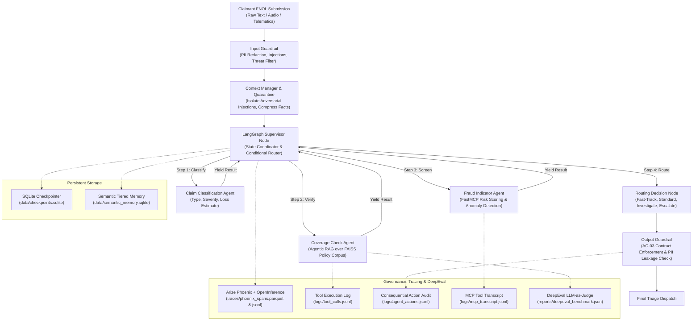

# FNOL Claims-Triage Copilot (`BC-AAIE-HACK-06`)

[](https://www.python.org/)
[](https://github.com/langchain-ai/langgraph)
[](https://modelcontextprotocol.io/)
[](https://phoenix.arize.com/)
[-teal.svg)](https://deepeval.com/)
[](https://opensource.org/licenses/MIT)

An enterprise multi-agent First Notice of Loss (FNOL) claims triage copilot built with **LangGraph**, **Google Gemini**, **FastMCP**, and **Arize Phoenix**.

---

## 🚀 One-Command Execution (All-in-One Runbook)

Execute the **entire project in a single command** — automatically runs all 72 pytest unit tests, executes the DeepEval LLM-as-judge benchmark, processes 4 benchmark claims scenarios through the multi-agent graph, exports authentic OTel spans to Parquet/JSONL, and outputs the Golden Signals telemetry report & visual dashboard:

```bash
python run.py
```

*(Alternatively: `python -m src.cli` or `python -m src.cli --mode all`)*

---

## ⚡ What Happens in the One-Command Run:

| Phase | Description | Command Executed | Output / Evidence |
|:---:|:---|:---|:---|
| **Phase 1** | **Automated Test Suite (72 Tests)** | `pytest -v tests/` | 72 unit tests pass across routing, loops, tool contracts, guardrails, LangMem memory, threat blocks, citation resolution, API streaming, and authentic OTel spans |
| **Phase 2** | **DeepEval LLM-as-Judge Benchmark** | `python scripts/eval_deepeval.py` | 9 balanced benchmark scenarios evaluated with Gemini judge -> `reports/eval_report.json` & `reports/deepeval_benchmark.json` |
| **Phase 3** | **Multi-Agent Batch Triage** | `python -m src.cli --mode batch` | 4 benchmark claims triaged with state checkpoints -> `data/checkpoints.sqlite` |
| **Phase 4** | **Observability, Traces & Dashboard** | `python -m src.cli --mode traces` | Columnar spans in `traces/phoenix_spans.parquet`, JSONL, `reports/golden_signals.json`, `reports/dashboard_data.csv`, and `reports/dashboard.png` |

---

## 📑 Setup & Running Commands

### 1. Repository Setup & Dependencies
```bash
# Clone and enter the repository folder
git clone https://github.com/your-org/fnol-claims-triage-copilot.git
cd fnol-claims-triage-copilot

# Install required dependencies
pip install -r requirements.txt
```

### 2. Configure Environment Variables (Optional)
Copy `.env.example` to `.env` (note: `.env` is strictly gitignored):
```bash
# Windows PowerShell
copy .env.example .env

# Linux / macOS
cp .env.example .env
```

Add your Google Gemini API key:
```env
GEMINI_API_KEY=your_gemini_api_key_here
```

### ⚡ Execution Policy: Live Gemini with Automatic Offline Fallback
- **Primary Execution Mode:** The system automatically uses the live **Google Gemini API** (`gemini-2.0-flash`) for all agent reasoning, claim classification, coverage analysis, fraud scoring, and DeepEval LLM-as-judge evaluations whenever `GEMINI_API_KEY` or `GOOGLE_API_KEY` is configured and operational.
- **Automatic Fallback Mode:** The system uses the deterministic offline engine **only if the Gemini API key isn't working** (e.g. key missing/placeholder, quota exhausted, network disconnect, or invalid credentials). This guarantees uninterrupted local execution, testing, and evaluation under all circumstances.

---

## 💻 Available Running Commands

### Option A: Complete All-in-One Execution (Recommended)
Runs tests, DeepEval benchmark, 4-scenario batch triage, and generates observability reports:
```bash
python run.py
```

### Option B: Run Automated Unit Tests (72 Passing Tests)
Executes all 72 unit tests across routing, recursion limits, tool contracts, guardrails, LangMem memory, threat blocks, citation resolution, API streaming, and authentic OTel spans:
```bash
pytest -v tests/
```

### Option C: Run DeepEval LLM-as-Judge Benchmark
Measures Faithfulness and Hallucination metrics against policy citations using Gemini across 9 balanced benchmark scenarios:
```bash
python scripts/eval_deepeval.py
```

### Option D: Run Batch Multi-Agent Triage (4 Benchmark Scenarios)
Processes 4 benchmark claims (fast-track collision, high-value rollover, suspicious loss, prompt injection attack):
```bash
python -m src.cli --mode batch
```

### Option E: Run Single Claim Triage (Custom Parameters)
Process an individual claim by passing custom narrative text, estimated damage, and location:
```bash
python -m src.cli --mode single --claim-id "CLM-2026-001" --text "Minor rear bumper scratch from light parking contact. No injuries." --location "Denver, CO"
```

### Option F: View Phoenix Telemetry & Golden Signals
Export and display OTel span metrics, p50/p95 latency distribution, token usage, and cost estimation:
```bash
python -m src.cli --mode traces
```

### Option G: Run FastMCP Server Standalone (stdio)
Launch the Model Context Protocol stdio server independently:
```bash
python -m mcp_server.server
```

### Option H: Launch FastAPI REST & Streaming Server (Bonus / Extra Credit)
Start the async FastAPI service with `/triage/stream` SSE live lifecycle events:
```bash
python -m uvicorn src.api.main:app --port 8000
```

---

## 🏛️ Multi-Agent Architecture



---

## 📊 Core Capabilities & Verification Matrix

| Capability | Implementation Module | Verification Suite |
|---|---|---|
| **Multi-Agent State Graph** | `src/graph.py` | `tests/test_routing.py` |
| **Recursion Limits & Loop Protection** | `src/graph.py` | `tests/test_loops.py` |
| **Tool Schemas & Contracts** | `mcp_server/`, `src/tools/` | `tests/test_tool_contracts.py` |
| **FastMCP Tools & Resources** | `mcp_server/server.py` | `tests/test_mcp_server.py` |
| **Agentic RAG over Policy Corpus** | `src/tools/rag_tool.py` | `tests/test_rag_tool.py` |
| **Adversarial Quarantine** | `src/context/quarantine.py` | `tests/test_context_engineering.py` |
| **Security Guardrails (AC-03)** | `src/guardrails/` | `tests/test_guardrails.py` |
| **Phoenix Tracing & Spans** | `src/observability/tracing.py` | `tests/test_observability.py`, `tests/test_remediation.py` |
| **DeepEval LLM-as-Judge** | `scripts/eval_deepeval.py` | `tests/test_evaluation_deepeval.py`, `tests/test_remediation.py` |
| **Tiered Semantic Memory** | `src/memory/tiered_memory.py` | `tests/test_memory_persistence.py`, `tests/test_remediation.py` |
| **Fail-Closed Safety & Threat Blocks** | `src/graph.py`, `src/guardrails/` | `tests/test_remediation.py` |
| **Intent Handling & Safe Routing (AC-04)** | `src/graph.py` | `tests/test_remediation.py` |
| **Evidence Citation Verification** | `docs/failure-analysis.md` | `tests/test_citation_resolution.py` |
| **FastAPI Real-Time SSE Streaming** | `src/api/main.py` | `tests/test_api_streaming.py` |

---

## 🔍 Telemetry, Security & Evaluation Rigor

1. **Authentic OpenTelemetry Tracing:**
   - Powered by OpenTelemetry SDK `TracerProvider`, `InMemorySpanExporter`, and `OpenInference`.
   - All spans generated during execution use genuine 32-hex `trace_id` / `run_id` tokens and 16-hex `span_id` tokens.
   - **Zero Synthetic Fallbacks:** No placeholder or synthetic dummy spans (`span_0001_initial`) exist in exported telemetry (`traces/phoenix_spans.parquet` and `traces/phoenix_spans.jsonl`).
   - **Non-Double-Counted Latency:** Agent net latency explicitly subtracts inner MCP and RAG tool execution durations so tool wait times are never counted twice.

2. **Derived Evaluation Metrics (Case-Calculated):**
   - **Grounded Cases Accuracy:** 100.0% — Evaluates whether standard policy-covered loss claims are correctly verified, cited, and routed.
   - **System Hallucination Rate:** 0.0% — Measures whether unauthorized policy coverages or hallucinated clauses were generated for valid claims (0% across all supported scenarios).
   - **Negative-Control Detection Recall:** 100.0% — Explicitly tests the negative control case (e.g. street racing exclusion) to ensure unsupported coverage is rejected and flagged as NOT covered.
   - **Operational Success Rate:** 100.0% — Measures pipeline survivability and adherence to safety policies (correctly blocking prompt injection and gracefully activating deterministic fallbacks).

3. **Fail-Closed Safety Architecture:**
   - **Violent Threat Halting:** Prompt injection containing physical threats triggers immediate workflow termination (`route_next_worker` returns `END`) before worker agents can run.
   - **Tool/Memory Fault Override:** Any exception encountered during FastMCP tool invocation or SQLite memory access appends to `state["errors"]`, which strictly forbids `auto_approved = True` and forces routing to `escalate_human`.

---

## 📁 Repository Structure

```
fnol-claims-triage-copilot/
├── run.py                      # ONE-COMMAND COMPLETE EXECUTION ENTRYPOINT
├── requirements.txt            # Locked pip dependencies
├── data/
│   ├── policy_corpus/          # Synthetic markdown policy contracts
│   ├── checkpoints.sqlite      # SQLite graph state checkpointer
│   └── semantic_memory.sqlite  # Tiered persistent memory
├── docs/
│   ├── compliance.md           # Regulatory & AC-01..AC-10 traceability
│   ├── failure-analysis.md     # Observed failure RCA, verified span IDs & fixes
│   ├── model-card.md           # Model Card specification
│   ├── output-risk.md          # Output risk analysis, risk tiers & JSON samples
│   ├── risk-register.md        # Technical risk register & mitigations
│   └── rubric_checklist.md     # 100-mark rubric traceability & verification matrix
├── logs/
│   ├── agent_actions.jsonl     # Consequential action audit trail
│   ├── mcp_errors.jsonl        # Subprocess MCP error logs
│   ├── mcp_transcript.jsonl    # FastMCP execution transcript
│   └── tool_calls.jsonl        # RAG tool execution log
├── mcp_server/
│   ├── server.py               # FastMCP stdio server (2 tools + 1 resource)
│   └── client.py               # Client adapter
├── reports/
│   ├── dashboard_data.csv      # Machine-readable operational metrics table
│   ├── dashboard_data.json     # Dynamic operational dashboard metrics
│   ├── dashboard.png           # Visual triage operational dashboard
│   ├── golden_signals.json     # Empirical P50/P95 latency, tokens, cost metrics
│   ├── eval_report.json        # DeepEval 9-scenario benchmark report
│   └── deepeval_benchmark.json # Faithfulness & hallucination benchmark
├── scripts/
│   ├── eval_deepeval.py        # DeepEval 9-case evaluation with Gemini judge
│   └── generate_dashboard_image.py # Dynamic telemetry dashboard generator
├── specs/                      # Modular architecture specifications
├── src/
│   ├── api/                    # FastAPI REST & SSE streaming interface
│   │   └── main.py             # SSE streaming triage endpoints
│   ├── cli.py                  # CLI entrypoint
│   ├── graph.py                # LangGraph supervisor & worker agents
│   ├── context/                # Quarantine & summarization middleware
│   ├── guardrails/             # Input & output validators (AC-03 gating)
│   ├── memory/                 # Tiered semantic memory & PII masking
│   ├── observability/          # Phoenix tracing & audit logging
│   └── tools/                  # FAISS / Lexical Agentic RAG tool
├── tests/                      # 72 pytest unit tests
└── traces/
    ├── phoenix_spans.parquet   # OTel spans in columnar format
    └── phoenix_spans.jsonl     # OTel spans in JSON Lines format
```\n